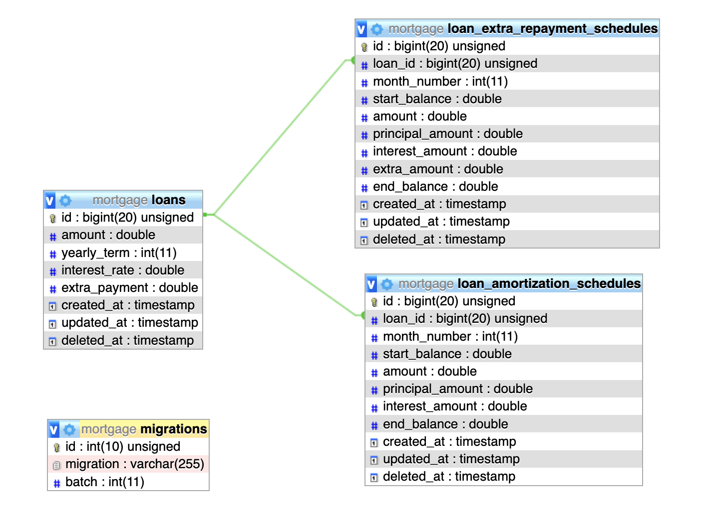

## About Mortgages

A mortgage loan calculator web application built using the PHP (Laravel 10) and Vue 3 is designed to assist users in making informed decisions about their mortgage loans. This application offers a range of features and functionalities related to mortgages

- Input Loan Details: Users can input essential loan details, including:

- Loan amount: The total amount borrowed for the mortgage.
- Interest rate: The annual interest rate for the loan.
- Loan term: The duration of the mortgage in months or years.
- Mortgage Loan Types: The application supports both fixed-term mortgages and mortgages with the option for extra repayments.

- Amortization Schedule: The core functionality of the application is to generate an amortization schedule. This schedule provides a detailed breakdown of the monthly payments over the entire loan term. It includes:

- Monthly Payment: The amount the borrower needs to pay each month.
- Principal Component: The portion of the payment that goes toward reducing the loan balance.
- Interest Component: The portion of the payment that represents the interest charged.
- Loan Setup Details: The application displays a header that summarizes the essential loan setup details, ensuring users have a clear understanding of their mortgage arrangement.

- Effective Interest Rate: The application calculates and displays the effective interest rate, which may differ from the nominal interest rate due to factors like extra repayments.

- Extra Payments: Users have the option to make extra payments towards their mortgage. The application also generates a schedule that reflects the impact of these extra payments on the loan term and the overall interest paid.

- Recalculated, Shortened Loans: The application generates schedules that show how extra payments made by the borrower can lead to a shorter loan term. This is useful for users who want to understand the benefits of making additional payments towards their mortgage.

### <a href="http://ec2-3-77-124-242.eu-central-1.compute.amazonaws.com">Live Demo</a>
## Requirements:
### Back-End:
- Apache or Nginx
- PHP 8.0
- Laravel 10.22.0
- Mysql 8
- Composer
### Front-End:
- Nodejs 18 or higher
- Npm
- Vue 3
- Inertia 3
- Vueitfy 3
- Html
- Css

## Instructions

- Clone project: 
  ``git clone https://github.com/shawkiIIalasy/mortgage.git``
- Move to project folder:
  ``cd mortgage``
- Run Composer:
  ``composer install``
- Create Enviroments file:
  ``cp .env.example .env``
- Setup Database Credential in .env: 
  - ``DB_CONNECTION=mysql``
  - ``DB_HOST={Database Host}``
  - ``DB_PORT={Database Port}``
  - ``DB_DATABASE={Database Name}``
  - ``DB_USERNAME={Database User}``
  - ``DB_PASSWORD={Password}``
- Generate Artisan Key:
  ``php artisan key:generate``
- Run Migrations: 
  ``php artisan migrate``
- Run Npm install:
  ``npm install``
- Run Npm:
  - ``npm run build`` for production
  - ``npm run dev`` for development
- Run Server:
  - ``php artisan serve`` for development
  
## Collection:
Postman: https://www.postman.com/winter-station-777177/workspace/mortgage-api-s/collection/10433486-97d41b5e-04b5-467b-a45d-d104acf51d20?action=share&creator=10433486

## API'S
### Loans
-  ``{{BASE_URL}}/api/v0/loans`` `GET` `INDEX`
-  ``{{BASE_URL}}/api/v0/loans/{id}`` `GET` `SHOW`
-  ``{{BASE_URL}}/api/v0/loans`` `POST` `CREATE`
-  ``{{BASE_URL}}/api/v0/loans/{id}`` `PUT` `UPDATE`

### Amortizations
-  ``{{BASE_URL}}/api/v0/amortizations`` `GET` `INDEX`
-  ``{{BASE_URL}}/api/v0/amortizations/{id}`` `GET` `SHOW`

### Extra Payment
-  ``{{BASE_URL}}/api/v0/extra-payments`` `GET` `INDEX`
-  ``{{BASE_URL}}/api/v0/extra-payments/{id}`` `GET` `SHOW`
-  ``{{BASE_URL}}/api/v0/extra-payments/{id}`` `POST` `PAY`

## Testing:
Run testing: ``php artisan test``

## Seeding: 
Run seeds: ``php artisan db:seed``

### Database Design: 

## Credits:
<a href="https://www.linkedin.com/in/shawki-alasy" target="_blank">Shawki Alassi</a>
